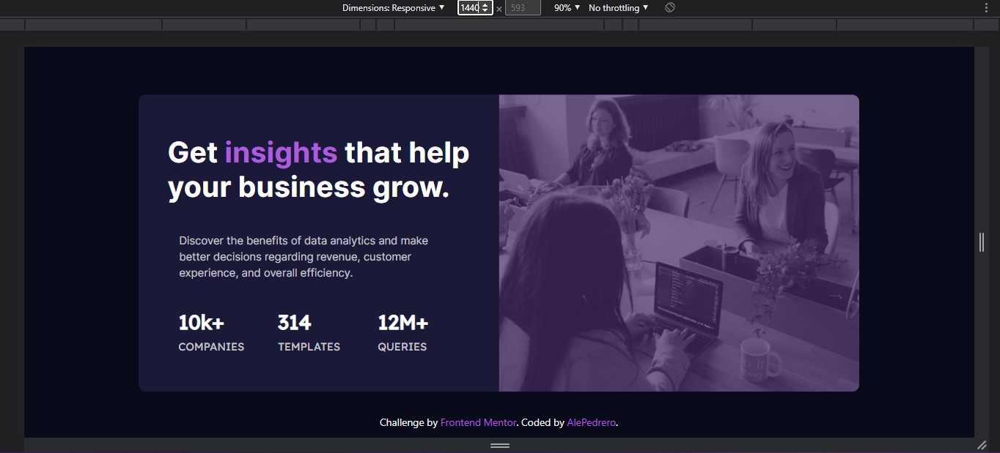
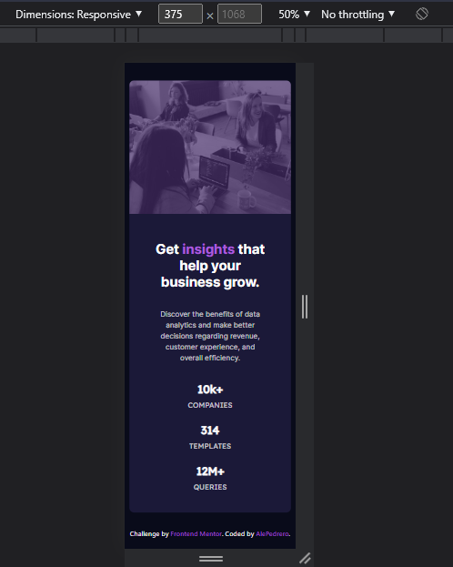

# Stats preview card component solution

This is my solution to the [Stats preview card component challenge on Frontend Mentor](https://www.frontendmentor.io/challenges/stats-preview-card-component-8JqbgoU62).

## Overview
In this challenge I had to recreate stats preview card using only HTML and CSS, and it had to be a responsive layout.

### Screenshots
------------

  

   

### Links

- Solution URL: [frontendmentor.io](https://your-solution-url.com)
- Live Site URL: [GitHub Pages](https://your-live-site-url.com)

## My process
To be able to complete this challenge, I had to write the essential mark up on HTML, and proceed to do the neccessary styles by using Bootstrap and CSS.

### Built with

- Semantic HTML5 markup
- CSS custom properties
- Flexbox
- CSS Grid
- Bootstrap

### What I learned
This challenge helped me a lot to practice my HTML/CSS and to use more Bootstrap properties. It also helped me to practice how to do responsive layouts, and be able to recreate the design expected for Mobile and for Desktop views.

### Useful resources

- [Bootstrap](https://getbootstrap.com/docs/5.1/getting-started/introduction/) - It helps a lot in terms of box modeling, and display properties. It's ten times easier!

## Author

- Website - [alejandra.dev](https://www.alejandra.dev/)
- Frontend Mentor - [@AlePedrero](https://www.frontendmentor.io/profile/AlePedrero)
- Twitter - [@codedbyale](https://www.twitter.com/codedbyale)
